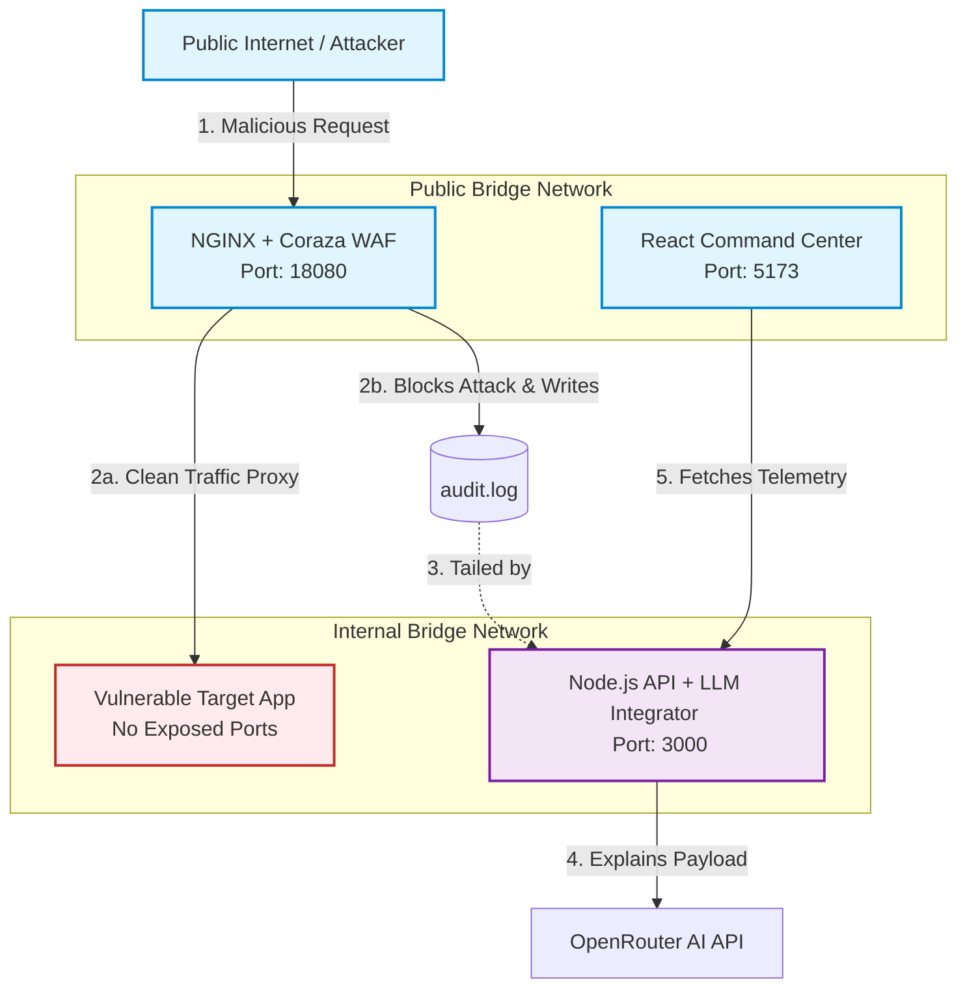

# Vigiles: Next-Gen AI-Assisted Web Application Firewall (WAF) 🛡️

A Zero-Trust security architecture utilizing NGINX, Coraza (OWASP CRS), and a Node.js telemetry backend to instantly detect, block, and translate malicious web traffic into human-readable AI summaries.

---

## 🌟 The Problem

Traditional WAFs are computationally heavy and generate massive, cryptic log files that cause alert fatigue. Developers and Security Engineers waste hours deciphering ModSecurity payloads to determine if an alert is a false positive or a critical breach.

---

## 🚀 The Solution

This project acts as an automated SecOps analyst. It places a lightning-fast WebAssembly WAF at the network edge to block attacks in real-time. An asynchronous Node.js backend tails the logs, filters out benign traffic, and uses an LLM to explain the exact nature of the blocked exploit in plain English.

---

## ✨ Key Features

* **Zero-Trust Isolation:** The target application is completely severed from the public internet, accessible only through the WAF's internal Docker bridge network.
* **Real-Time AI Telemetry:** Blocked payloads are parsed and sent to an LLM (via OpenRouter) for instant threat translation.
* **SecFinOps ROI Dashboard:** A React frontend calculates the "Compute Waste Prevented" by dropping bad traffic at the edge, proving the financial value of the WAF.

---

## 🏗️ Architecture Flow



---

## 🚦 How to Run the Project

### 🧰 Prerequisites

* Docker and Docker Compose installed
* An OpenRouter API key

---

### ⚙️ Setup

1. Clone the repository and navigate to the root directory:

```bash
git clone <your-repo-url>
cd <your-repo-name>
```

2. Add your OpenRouter API key to the backend environment file:

```bash
echo "OPENAI_API_KEY=your_key_here" > api-backend/.env
```

3. Spin up the infrastructure:

```bash
docker compose up -d --build
```

4. Access the Command Center Dashboard:

```
http://localhost:5173
```

5. Run the automated attack suite:

```bash
./test-attacks.sh
```

---

## 📌 Notes

* Ensure ports `18080`, `5173`, and `3000` are available
* Logs are written to `audit.log` and processed asynchronously
* Designed for **real-time threat detection + AI explainability**

---

## 🧠 Why This Matters

This project bridges the gap between **security and developer experience** by turning raw WAF logs into **actionable intelligence**, reducing alert fatigue and improving response time.

---

